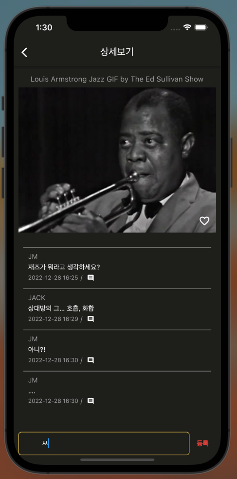

# MY Bias
좋아하는 GIF에 하트를 남기고 댓글로 소통할 수 있습니다.  
MyTab에서는 유저가 좋아요한 GIF 컬렉션을 볼 수 있습니다.  

## Dev Stack
BE : node.js, express, mysql  
FE : Flutter

### GIF OPEN API 
https://developers.giphy.com/

### BE Flow

### DB ERD

## 메인 페이지

## 디테일 페이지

 

## 마이탭

## DEMO
 